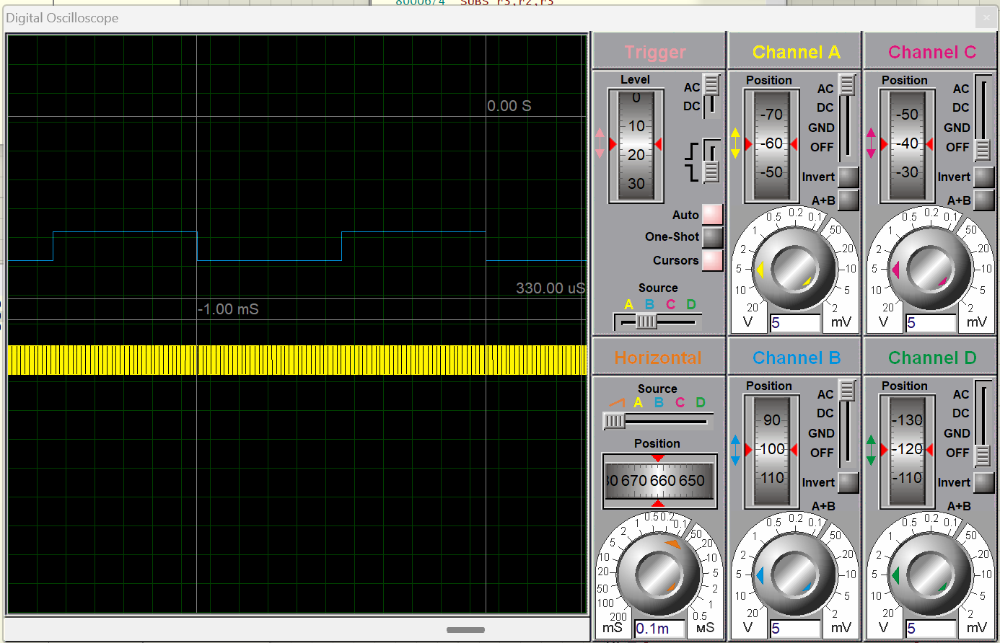
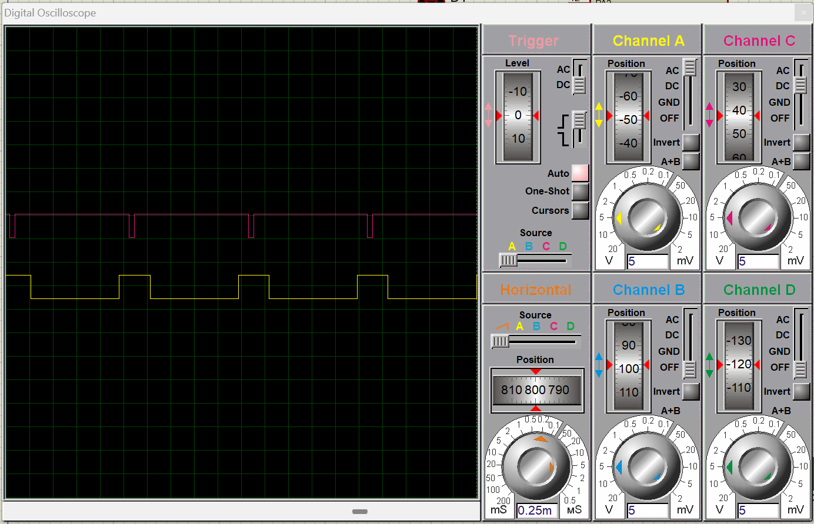
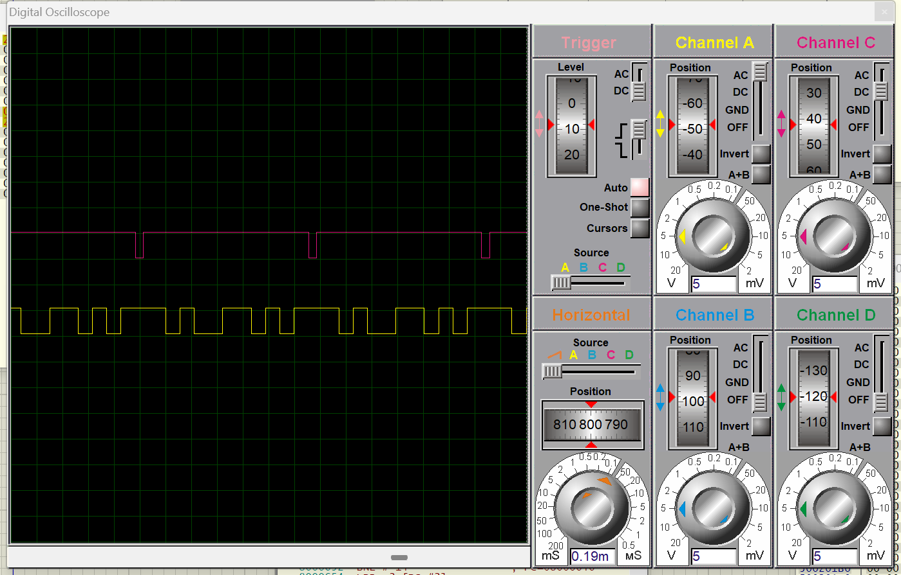
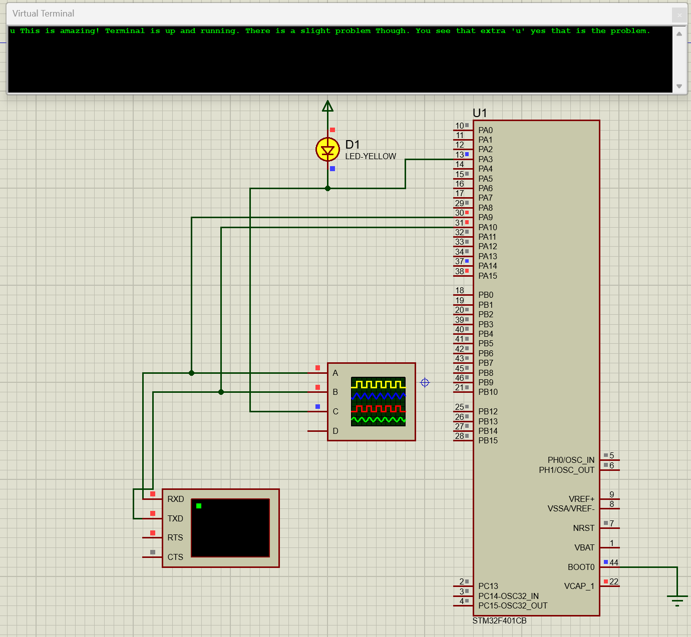

# STM32 Drivers

# Introduction

This repo contains files for stm32IDE and proteus simulation for stm32f401CB MCU.

---

## PWM With Timer 1

In this one I utilized timer to perform PWM. API functions were coded by
me to generate a PWM whose frequency (in Khz), Mode, Duty Cycle (in percentage),
and Prescaler for the input clock.

by using prescaler of 15 for input clock of 16MHz, a 1Khz 50 percent duty cycle PWM is shown
in the figure below.

## UART1 testing

In my first attempt i used UART1 in its default configuration, it ran on 9600
baudrate and with a peripheral clock of 16MHz on its AHB1 Bus and APB2 Bus.

registers that were used in the file are given as follows:

| Register | Purpose |
|---|---|
| RCC_AHB1ENR | To enable clock for GPIOA Port. |
| RCC_APB2ENR | To enable clock for USART1. |
| GPIOA_MODER | To set Mode of port 9,10 as Alternate Function. |
| GPIOA_AFRH | To set AF7 value to 9, and 10 to enable UART pins to the I/O. |
|---|---|
| USART_SR | Status Register |
| USART_DR | Data Register |
| USART_BRR | To set Baudrate |
| USART_CR1 | Control register 1 |
|---|---|

## Proteus Demonstartion

The following image shows the start and end bits of UART TX line demonstrating 
and marking it with HIGH on line 2.

The image 2 showcases how a valley is formed with LSB = 1

The next iamge shows a complet byte transfer in an loop.

following iamge shows the demonstartion of sending ascii byte and implementing
printf() like function in the bare minimum pure register level coding.

